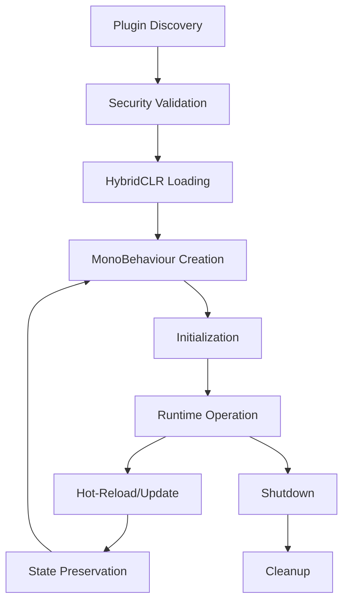

# Unity Plugin System Documentation

## Overview

The WingedBean Unity Plugin System provides a comprehensive framework for creating, loading, and managing plugins within Unity applications. It extends the core WingedBean plugin architecture with Unity-specific features including MonoBehaviour lifecycle management, hot-reload with state preservation, and Unity-specific security permissions.

## Table of Contents

1. [Architecture Overview](#architecture-overview)
2. [Getting Started](#getting-started)
3. [Plugin Development](#plugin-development)
4. [Hot-Reload System](#hot-reload-system)
5. [Security Framework](#security-framework)
6. [API Reference](#api-reference)
7. [Best Practices](#best-practices)
8. [Troubleshooting](#troubleshooting)

## Architecture Overview

The Unity Plugin System consists of several key components:

### Core Components

- **HybridClrPluginLoader**: Loads Unity plugins using HybridCLR for hot-reload support
- **LoadedUnityPlugin**: Manages Unity-specific plugin instances with MonoBehaviour integration
- **UnityPluginHotReloadManager**: Handles hot-reload operations with state preservation
- **UnityPluginPermissionEnforcer**: Enforces Unity-specific security permissions
- **UnityPluginSecurityVerifier**: Validates plugin compatibility and security

### Plugin Lifecycle



## Getting Started

### Prerequisites

- Unity 2022.3 LTS or later
- .NET 9.0 SDK
- HybridCLR package installed in Unity project

### Installation

1. **Add the WingedBean.Host.Unity package to your Unity project:**

```json
{
  "dependencies": {
    "com.wingedbean.host.unity": "file:../../projects/unity/WingedBean.Host.Unity"
  }
}
```

2. **Configure HybridCLR in your Unity project:**

```csharp
// In your Unity project's build settings
[MenuItem("WingedBean/Setup HybridCLR")]
public static void SetupHybridCLR()
{
    // Add HybridCLR configuration
    var settings = HybridCLRSettings.Instance;
    settings.enable = true;
    settings.useGlobalIl2cpp = false;
}
```

3. **Initialize the plugin system in your Unity application:**

```csharp
public class PluginSystemBootstrap : MonoBehaviour
{
    private IPluginHost _pluginHost;

    private async void Start()
    {
        var services = new ServiceCollection();
        services.AddWingedBeanHost();
        services.AddUnityPluginSupport();

        var serviceProvider = services.BuildServiceProvider();
        _pluginHost = serviceProvider.GetRequiredService<IPluginHost>();

        await _pluginHost.InitializeAsync();

        // Load plugins from specified directory
        await _pluginHost.LoadPluginsFromDirectoryAsync("Assets/Plugins");
    }
}
```

## Plugin Development

### Creating a Unity Plugin

1. **Create a new .NET Standard 2.1 project:**

```xml
<Project Sdk="Microsoft.NET.Sdk">
  <PropertyGroup>
    <TargetFramework>netstandard2.1</TargetFramework>
    <OutputPath>../UnityProject/Assets/Plugins/YourPlugin</OutputPath>
  </PropertyGroup>

  <ItemGroup>
    <ProjectReference Include="../WingedBean.Host.Unity/WingedBean.Host.Unity.csproj" />
  </ItemGroup>
</Project>
```

2. **Define your plugin manifest (`plugin.json`):**

```json
{
  "id": "com.yourcompany.yourplugin",
  "version": "1.0.0",
  "name": "Your Unity Plugin",
  "description": "Description of your plugin",
  "author": "Your Name",

  "entryPoint": {
    "unity": "./YourPlugin.dll"
  },

  "unity": {
    "minUnityVersion": "2022.3.0",
    "supportedPlatforms": ["StandaloneWindows64", "StandaloneOSX"],
    "monoBehaviourComponents": ["YourPluginBehaviour"],
    "persistAcrossScenes": false,
    "initializationOrder": 0
  },

  "security": {
    "permissions": {
      "unity": {
        "canCreateGameObjects": true,
        "canAddComponents": true,
        "allowedComponentTypes": ["YourPluginBehaviour"]
      }
    }
  }
}
```

3. **Implement your MonoBehaviour components:**

```csharp
using UnityEngine;
using WingedBean.Host.Unity.Core;

public class YourPluginBehaviour : MonoBehaviour, IStatefulComponent
{
    public string PlayerName { get; set; } = "Player";
    public int Score { get; set; } = 0;

    private void Start()
    {
        Debug.Log($"Plugin initialized: {PlayerName}");
    }

    private void Update()
    {
        // Your plugin logic here
    }

    // State preservation for hot-reload
    public Dictionary<string, object> GetState()
    {
        return new Dictionary<string, object>
        {
            ["PlayerName"] = PlayerName,
            ["Score"] = Score
        };
    }

    public void RestoreState(Dictionary<string, object> state)
    {
        if (state.TryGetValue("PlayerName", out var name))
            PlayerName = name?.ToString() ?? "Player";

        if (state.TryGetValue("Score", out var score))
            Score = Convert.ToInt32(score);
    }
}
```

4. **Optional: Implement plugin services:**

```csharp
using Microsoft.Extensions.DependencyInjection;
using WingedBean.Host.Core;

[PluginEntryPoint]
public class YourPluginEntryPoint : IPluginEntryPoint
{
    public void ConfigureServices(IServiceCollection services)
    {
        services.AddSingleton<IYourService, YourService>();
    }

    public async Task InitializeAsync(IServiceProvider serviceProvider)
    {
        var logger = serviceProvider.GetRequiredService<ILogger<YourPluginEntryPoint>>();
        logger.LogInformation("Plugin services initialized");
    }
}
```

## Hot-Reload System

The Unity Plugin System supports hot-reload with state preservation:

### How Hot-Reload Works

1. **File System Monitoring**: The system monitors plugin files for changes
2. **State Capture**: Current component states are captured before unloading
3. **Plugin Reload**: New plugin version is loaded using HybridCLR
4. **State Restoration**: Previously captured states are restored to new components

### Implementing State Preservation

To support hot-reload, implement the `IStatefulComponent` interface:

```csharp
public class StatefulBehaviour : MonoBehaviour, IStatefulComponent
{
    [SerializeField] private int _persistentValue;
    [SerializeField] private string _persistentText;

    public Dictionary<string, object> GetState()
    {
        return new Dictionary<string, object>
        {
            ["persistentValue"] = _persistentValue,
            ["persistentText"] = _persistentText,
            ["transform.position"] = transform.position,
            ["transform.rotation"] = transform.rotation
        };
    }

    public void RestoreState(Dictionary<string, object> state)
    {
        if (state.TryGetValue("persistentValue", out var value))
            _persistentValue = Convert.ToInt32(value);

        if (state.TryGetValue("persistentText", out var text))
            _persistentText = text?.ToString() ?? string.Empty;

        if (state.TryGetValue("transform.position", out var pos))
            transform.position = (Vector3)pos;

        if (state.TryGetValue("transform.rotation", out var rot))
            transform.rotation = (Quaternion)rot;
    }
}
```

### Manual Hot-Reload Trigger

```csharp
// Trigger hot-reload programmatically
var hotReloadManager = serviceProvider.GetRequiredService<UnityPluginHotReloadManager>();
await hotReloadManager.ReloadAllPluginsAsync();
```

## Security Framework

### Permission System

Unity plugins operate under a permission-based security model:

#### Available Permissions

- `unity.gameobject.create`: Create new GameObjects
- `unity.gameobject.destroy`: Destroy existing GameObjects
- `unity.component.add`: Add components to GameObjects
- `unity.component.remove`: Remove components from GameObjects
- `unity.scene.access`: Access Scene management APIs
- `unity.input.access`: Access Input system
- `unity.rendering.access`: Access rendering subsystem
- `unity.assets.access`: Access asset loading/management

#### Configuring Permissions

```json
{
  "security": {
    "permissions": {
      "unity": {
        "canCreateGameObjects": true,
        "canDestroyGameObjects": false,
        "canAddComponents": true,
        "canRemoveComponents": false,
        "canAccessSceneManager": false,
        "canAccessInput": true,
        "canAccessRendering": true,
        "allowedComponentTypes": [
          "YourPluginBehaviour",
          "AnotherAllowedComponent"
        ]
      }
    }
  }
}
```

#### Enforcing Permissions in Code

```csharp
public class SecurePluginBehaviour : MonoBehaviour
{
    private IUnityPluginPermissionEnforcer _permissionEnforcer;

    private void Start()
    {
        _permissionEnforcer = FindObjectOfType<UnityPluginHost>()
            .GetService<IUnityPluginPermissionEnforcer>();
    }

    public void CreateGameObject()
    {
        // This will throw UnauthorizedAccessException if permission not granted
        _permissionEnforcer.EnforcePermission(
            "com.yourcompany.yourplugin",
            "unity.gameobject.create"
        );

        var newObject = new GameObject("PluginCreatedObject");
    }
}
```

## API Reference

### Core Classes

#### `HybridClrPluginLoader`

Loads Unity plugins using HybridCLR.

```csharp
public class HybridClrPluginLoader : IPluginLoader
{
    public bool CanLoadPlugin(PluginLoadContext context);
    public Task<ILoadedPlugin> LoadPluginAsync(PluginLoadContext context);
}
```

#### `LoadedUnityPlugin`

Represents a loaded Unity plugin with MonoBehaviour management.

```csharp
public class LoadedUnityPlugin : ILoadedPlugin
{
    public string Id { get; }
    public string Version { get; }
    public bool IsLoaded { get; }
    public bool IsInitialized { get; }

    public Task InitializeAsync();
    public Task ShutdownAsync();
    public Task<Dictionary<string, object>> GetStateAsync();
    public Task RestoreStateAsync(Dictionary<string, object> state);
    public GameObject[] GetPluginGameObjects();
}
```

#### `UnityPluginHotReloadManager`

Manages hot-reload operations for Unity plugins.

```csharp
public class UnityPluginHotReloadManager : IPluginUpdateManager
{
    public bool CanUpdatePlugin(ILoadedPlugin currentPlugin, ILoadedPlugin newPlugin);
    public Task UpdatePluginAsync(ILoadedPlugin currentPlugin, ILoadedPlugin newPlugin);
    public Task ReloadAllPluginsAsync();
}
```

### Interfaces

#### `IStatefulComponent`

Interface for components that support state preservation during hot-reload.

```csharp
public interface IStatefulComponent
{
    Dictionary<string, object> GetState();
    void RestoreState(Dictionary<string, object> state);
}
```

#### `IUnityPluginPermissionEnforcer`

Interface for enforcing Unity-specific permissions.

```csharp
public interface IUnityPluginPermissionEnforcer : IPluginSecurity
{
    bool IsComponentTypeAllowed(string pluginId, string componentType);
    UnityPermissions? GetUnityPermissions(string pluginId);
    void RegisterPlugin(PluginManifest manifest);
    void UnregisterPlugin(string pluginId);
}
```

## Best Practices

### Plugin Development

1. **Keep Components Lightweight**: Avoid heavy computations in MonoBehaviour Update methods
2. **Implement State Preservation**: Always implement `IStatefulComponent` for hot-reload support
3. **Use Dependency Injection**: Leverage the built-in DI container for service management
4. **Handle Permissions Gracefully**: Check permissions before performing restricted operations
5. **Minimize Unity API Usage**: Reduce coupling to Unity-specific APIs where possible

### Performance Considerations

1. **Lazy Loading**: Load plugin resources only when needed
2. **State Optimization**: Keep state data minimal and serializable
3. **Component Pooling**: Reuse GameObjects and components when possible
4. **Memory Management**: Properly dispose of resources in `OnDestroy()`

### Security Guidelines

1. **Principle of Least Privilege**: Request only necessary permissions
2. **Input Validation**: Validate all external inputs and data
3. **Resource Limits**: Implement safeguards against resource exhaustion
4. **Secure Storage**: Avoid storing sensitive data in plugin state

## Troubleshooting

### Common Issues

#### Plugin Not Loading

**Symptoms**: Plugin appears in directory but doesn't load

**Solutions**:
1. Check Unity version compatibility in manifest
2. Verify platform support matches current build target
3. Ensure HybridCLR is properly configured
4. Check assembly dependencies are available

#### Hot-Reload Not Working

**Symptoms**: Plugin changes don't take effect during runtime

**Solutions**:
1. Implement `IStatefulComponent` interface correctly
2. Ensure plugin manifest includes all MonoBehaviour components
3. Check file system permissions for plugin directory
4. Verify HybridCLR metadata is up to date

#### Permission Denied Errors

**Symptoms**: `UnauthorizedAccessException` during plugin execution

**Solutions**:
1. Review plugin manifest permissions configuration
2. Ensure requested permissions are granted by host application
3. Check component type restrictions in security settings
4. Verify plugin is properly registered with permission enforcer

#### State Not Preserved

**Symptoms**: Component state resets after hot-reload

**Solutions**:
1. Verify `GetState()` returns all necessary data
2. Ensure `RestoreState()` handles all state keys
3. Check for serialization issues with complex objects
4. Verify component is marked as stateful in manifest

### Debug Logging

Enable detailed logging for troubleshooting:

```csharp
services.AddLogging(builder =>
{
    builder.AddConsole();
    builder.SetMinimumLevel(LogLevel.Debug);
    builder.AddFilter("WingedBean.Host.Unity", LogLevel.Debug);
});
```

### Performance Profiling

Use Unity's Profiler to monitor plugin performance:

```csharp
using UnityEngine.Profiling;

public class ProfiledPluginBehaviour : MonoBehaviour
{
    private void Update()
    {
        Profiler.BeginSample("Plugin Update");
        try
        {
            // Your plugin logic here
        }
        finally
        {
            Profiler.EndSample();
        }
    }
}
```

## Conclusion

The WingedBean Unity Plugin System provides a robust foundation for creating modular Unity applications. By following the guidelines and best practices outlined in this documentation, you can create powerful, maintainable plugins that take full advantage of Unity's capabilities while maintaining security and performance.

For additional support and examples, refer to the sample projects included in the WingedBean repository.
